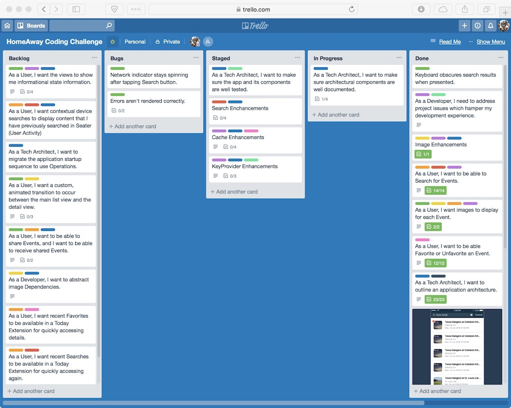
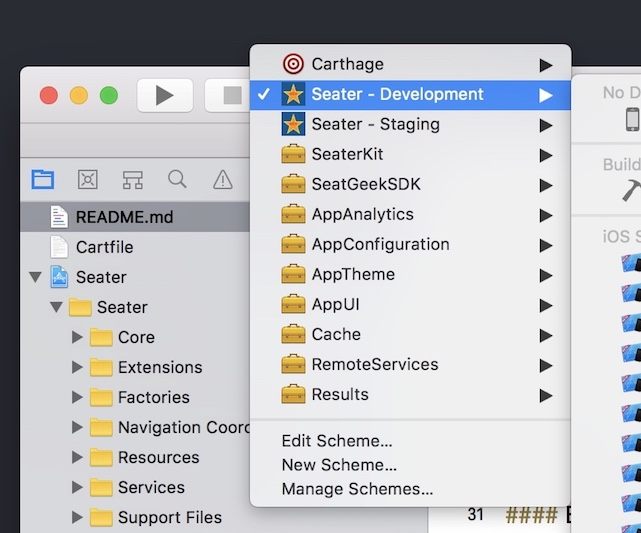

[](https://github.com/Carthage/Carthage)
[](https://opensource.org/licenses/MIT)


# Seater
```
A sample app demonstrating usage of the SeatGeek api.
```

## Requirements
* Xcode 10.1 (beta 2)
* iOS 12.1
* Swift 4.2 
* Carthage (current version `0.31.1`)

## Links
* https://github.com/homeaway/iOS-Coding-Challenge
* [Agile Board on Trello](https://trello.com/b/IbVuj3sP)

* [Project Notes on Evernote](https://www.evernote.com/shard/s579/sh/ef74fe1f-3955-4fe0-914f-40ebb7ee201a/79552387c0b5e8851e3c9b2cd96b1aab)

---

## Features
* #### Event Search against SeatGeek API

* #### Mark Events as Favorites

* #### Persistent Favorites


---

## Usage
#### Setup
1. Clone the repo.
```
git clone git@github.com:davemess/Seater.git
```
2. **REQUIRED:** Update Carthage dependencies. There is one required, third-party dependency for image fetching and caching.
```
carthage update --platform iOS
```
3. **REQUIRED:** This app requires a SeatGeek client ID which is supplied by a `Keys.swift` file. For security purposes, that file is not included in the public repository. Email the repo owner for that file. **The project will not compile without the Keys file.**
4. Open using Xcode. Build and run the Development scheme. There are multiple schemes (Development, Staging, etc.) included with the project.



#### Branching
Gitflow is the guiding branch strategy. In addition to feature and bug branches, there are long-lived branches:
* `develop` bleeding-edge development and merge-branch for feature work
* `master` App Store distribution; releases should be marked with tags

#### Configurations
User-defined configuration settings can be found in the xcconfig files in `Configurations` directory.

---

## Architecture

###### This app is fully modularized. The following describes each component:

- **Seater:** The Xcode project hosting the main app.
  - _Seater:_ The main app.
  - _SeaterKit:_ A module which defines functionality the app adopts. This can be reused in application extensions. This also defines an abstract EventService for supplying Event data which can be provided by any vendor.
  - _SeatGeekSDK:_ A concrete implementation of an EventService which hits the SeatGeek API. Built on top of RemoteServices framework.
- **SeaterAppKit:** A collection of useful utilities, modularized to improve performance and code reuse.
  - _AppAnalytics:_ Defines generic analytics recording.
  - _AppConfiguration:_ Used to identify the specific build configuration.
  - _AppTheme:_ Defines app theming utilities.
  - _AppUI:_ Various UI utilities.
  - _Cache:_ Defines memory and disk caching utilities.
  - _RemoteServices:_ A system for defining and performing remote service interaction.
  - _Results:_ Wraps response types.

- **External Dependencies:**
  - *[Kingfisher](https://www.google.com/url?sa=t&rct=j&q=&esrc=s&source=web&cd=1&cad=rja&uact=8&ved=2ahUKEwjH-7Dz1IneAhVPs1kKHalqC5IQFjAAegQIBRAC&url=https%3A%2F%2Fgithub.com%2Fonevcat%2FKingfisher&usg=AOvVaw1TkE7JB2NOItIeTtmgaiNs):* A Swift library for downloading and caching.
---

### License

Seater is available under the MIT license. See the LICENSE file for more info.

### Acknowledgements
Powered by 

---
